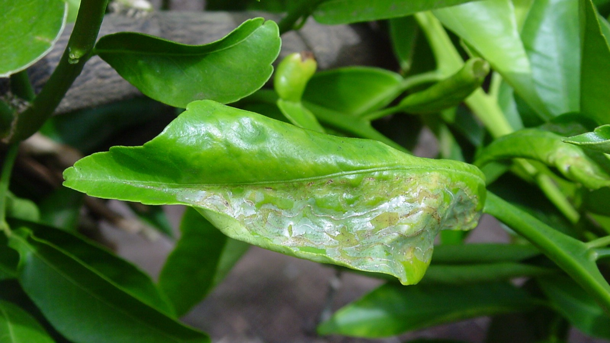

# A deep learning approach for classifying citrus diseases

<br>
<p align="center">
  
</p>
<p align="center"><em>Courtesy of Department of Agriculture and Food (agric.wa.gov.au)</em></p>

## Overview
This repository contains the code for a dual track deep fusion network for citrus disease classification. The network is based on the Group Shuffle Depthwise Feature Pyramid (GSDFP) and Swin Transformer architectures. The GSDFP is a feature extraction module that efficiently extracts local features from input images. The Swin Transformer is a global context aggregation module that captures long-range dependencies between features. By combining the GSDFP and Swin Transformer architectures, the network is able to achieve both strong local feature extraction and effective global context aggregation. 

## Table of Contents
- [Overview](#overview)
- [Installation](#installation)
- [Repository Structure](repository-structure)
- [References](#references)
- [To Cite](#to-cite)
- [License](#license)

## Installation

To use these scripts, you'll need Python installed on your system. Additionally, you may need to install some Python packages to run the scripts. You can do this using pip:

```bash
pip install -r requirements.txt
```

## Usage
Clone the repository to your local machine and navigate to the repository's directory:

```bash
git clone https://github.com/TimG27/dual-track-citrus.git
cd dual-track-citrus.git
```

## Repository Structure

    .
    ├── Network-Architecture                  # Contains Jupyter notebooks for the network architecture.
    ├── Network-Results                       # Contains Jupyter notebooks for the network results.
    ├── Pre-trained Models                    # 	Contains Jupyter notebooks for pre-trained models.                
    └── ..

### Network Architecture    
    
    .
    ├── ...
    ├── Network-Architecture                  
    │   ├── 1_Full_Network_Test_Dataset.ipynb      # Demonstrates how to train the full network on the training dataset.
    │   ├── 2_CNN_Network.ipynb                    # Demonstrates how to train the CNN network.
    │   ├── 3_Transformer_Network.ipynb            # Demonstrates how to train the Transformer network.
    └── ...

### Network Results

    .
    ├── ...
    ├── Network-Results                  
    │   ├──  1_Confusion_Matrix_ROC.ipynb          # Generates the confusion matrix and ROC curve for the network
    │   ├──  2_AUC_Params.ipynb                    # Calculates the AUC-ROC curve for different parameter settings. 
    └── ...

### Pre-trained Models

    .
    ├── ...
    ├── Pre-trained Models              
    │   ├──  1_DenseNet201.ipynb                  # Demonstrates how to load and use the pre-trained DenseNet201 model.
    │   ├──  2_EfficientNetB0.ipynb               # Demonstrates how to load and use the pre-trained EfficientNetB0 model.
    │   ├──  3_MobileNetV2.ipynb                  # Demonstrates how to load and use the pre-trained MobileNetV2 model.
    │   ├──  4_VGG_16.ipnyb                       # Demonstrates how to load and use the pre-trained VGG_16 model.
    │   ├──  5_AlexNet.ipynb                      # Demonstrates how to load and use the pre-trained AlexNet model.
    └── ...


## References

- [1] Adeel H, “Focal Loss,” GitHub, https://github.com/AdeelH/pytorch-multi-class-focal-loss/blob/master/focal_loss.py 
- [2] wofmanaf, “SA-Net,” GitHub, https://github.com/wofmanaf/SA-Net/blob/main/models/sa_resnet.py  
- [3] Microsoft, “Semantic Segmentation Pytorch,” GitHub, https://github.com/microsoft/AI-For-Beginners/blob/main/lessons/4-ComputerVision/12Segmentation/SemanticSegmentationPytorch.ipynb 
- [4] Beijing Technology and Business University, “Fe-net,” GitHub, https://github.com/btbuIntelliSense/Fe-net/blob/main/Model/FENet.py
- [5] Shicai, “How to modify a conv2d to depthwise separable convolution?,” PyTorch Forums, https://discuss.pytorch.org/t/how-to-modify-a-conv2d-to-depthwise-separable-convolution/15843/7

## To Cite

Karthik, R., Sameeha Hussain, Timothy Thomas George, and Rashmi Mishra. "A dual track deep fusion network for citrus disease classification using group shuffle depthwise feature pyramid and Swin transformer." Ecological Informatics 78 (2023): 102302.

## License
This project is licensed under the GNU Affero General Public License v3.0 License - see the `LICENSE.md` file for details.
